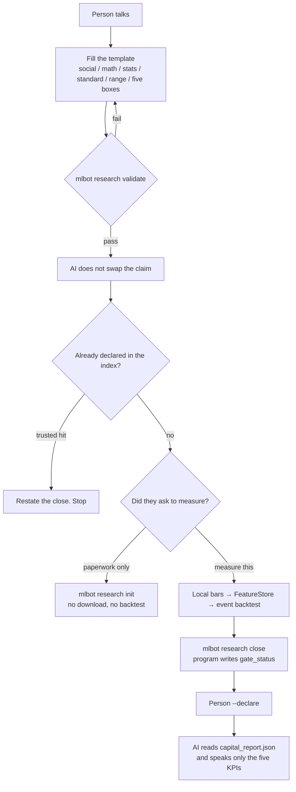
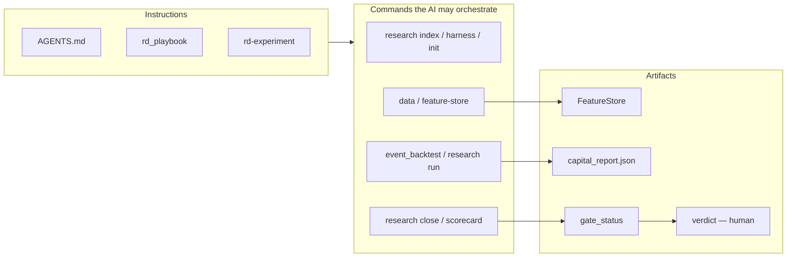

# Architecture

> Research core: a person talks → fill the hypothesis template → the AI checks the template → it may only measure with local commands → the program writes the numbers → the person declares.  
> This repo is a hypothesis validator. Not an order ticket. Not a CLI cheat-sheet for humans.

Landing: [README.md](../README.md) · [README_CN.md](../README_CN.md)  
中文: [ARCHITECTURE.md](ARCHITECTURE.md)

---

## Why this face matters

A web AI concludes from articles and memory. Another model, another story.  
This repo **locks the AI onto one measurement machine**. It must not use the web as evidence and must not type `verdict`. What it can do is turn your sentence into a few testable lines, orchestrate the commands below, read the files those commands leave, and speak the five KPIs back to you.

So the commands are not a power-user toolbox. They are **the only ruler the AI is allowed to use**.  
The instructions (`AGENTS.md`, the court playbook, the `rd-experiment` skill) say when the ruler may move, and who writes which field.

---

## Person, instructions, commands, report



| Who | Writes | Does not write |
|---|---|---|
| Person | The sentence, `verdict` | Must not let the AI declare |
| Instructions | When measuring is allowed, which ruler | Not the numbers |
| Commands / program | FeatureStore, three windows, `gate_status`, five KPIs | Not `verdict` |
| AI | Template, structural check, command order, reading artifacts, restating numbers | No web evidence, no hand-edited `verdict` |

Until someone says “measure this,” the AI may only check lineage, the harness, and open a folder. No download. No backtest.

---

## Do the public commands run

Checked on this machine: the four `mlbot` groups and `event_backtest --help` start. Court commands really read and write experiment folders. Data and backtest need local trades / FeatureStore; a missing file is a missing input, not a broken entry point.

| Command | Now | Notes |
|---|---|---|
| `mlbot features list` / `count` | Runs | Registered compute functions |
| `mlbot data download` / `convert` / `pipeline` | Entry runs | Needs the network for Binance zips |
| `mlbot data download-funding-rate` / `download-open-interest` | Entry runs | The funding example needs funding parquet |
| `mlbot feature-store build` | Entry runs | Backfill the store; do not invent a column in the backtest |
| `mlbot research index` / `harness` / `init` / `close` / `scorecard` / `stale` / `standardize` | Runs | Court paperwork. `--trusted` only sees declared rows |
| `mlbot research review` | Runs | Needs an id or `--all`; bare invoke is a usage error |
| `mlbot research run` / `python -m scripts.event_backtest` | Entry runs | Only if asked to measure; three windows, kill switch off, `feature_store_strict` |
| `mlbot lab` | Entry runs | Local court portal: `/rd`, `/rd/qa`, `/browse`. No auxiliary trading / CMS |
| `--margin-mode coin_m` | **Refused on purpose** | Public court is USD-M |

Day to day, talk to the AI. If you type by hand, use the table above. There is no `mlbot train` / `console` / `pipeline`.

Flags: [usage.en.md](usage.en.md). Who writes which field: [agent/rd_playbook.md](agent/rd_playbook.md).

---

## Research pipeline (inside the ruler)

```
FeatureStore (open-bar index, close-known)
    │
    ├─ Prefilter     is this geometry here
    ├─ Direction     +1 / -1 / 0
    ├─ Gate          hard deny / soft
    ├─ Entry Filter  timing (may be empty)
    ├─ Execution     stop / add / structural exit
    └─ intent → event_backtest (three windows, kill switch off) → court
```

The FeatureStore only measures. Rules live in `config/strategies/<family>/archetypes/*.yaml`.



---

## Key paths

| Path | Role |
|---|---|
| `src/feature_store/` | Monthly parquet + meta |
| `src/features/` | Feature compute |
| `config/feature_dependencies.yaml` | Feature DAG |
| `src/research/` | Court / gate / harness |
| `src/cli/main.py` | Public `mlbot` |
| `src/lab/` | `mlbot lab`: experiments / Q&A / results browse |
| `scripts/event_backtest/` | Event backtest |
| `config/strategies/ma_cross/` | Public dummy |

Feature compute, order flow, incremental columns: [features.en.md](features.en.md).

Landing: [README.md](../README.md) · prev [Court](agent/rd_playbook.md)
