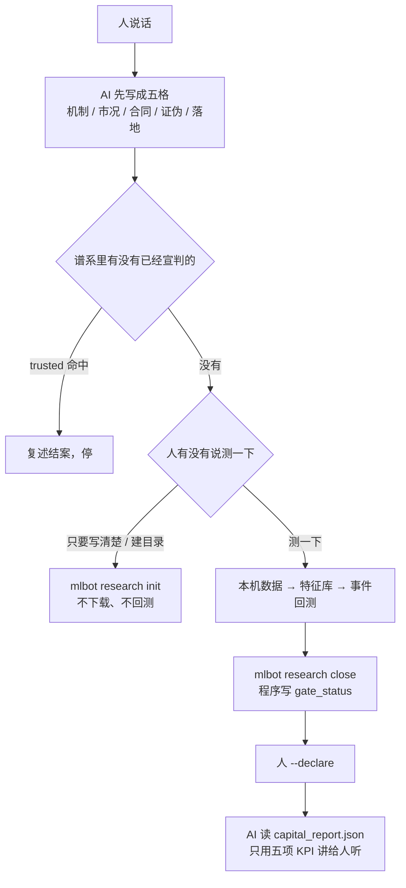
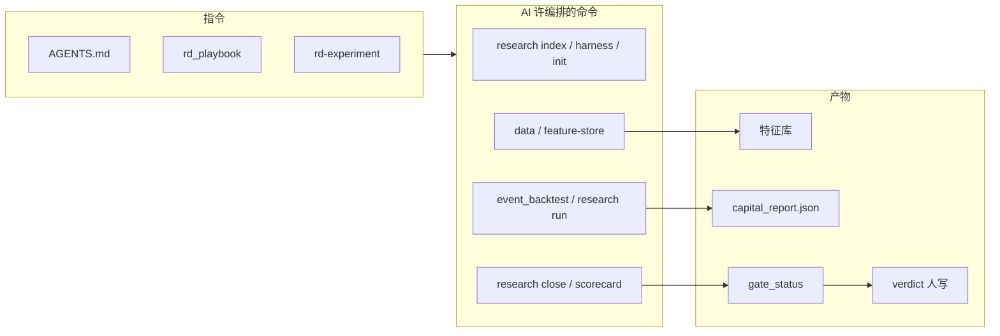

# 系统架构

> 研究核：人说话 → AI 按指令收成五格 → 只许用本机命令量 → 程序写数字 → 人宣判。  
> 不是下单说明书，也不是给人手抄的命令手册。

主入口：[README_CN.md](../README_CN.md) · [README.md](../README.md)  
English: [ARCHITECTURE.en.md](ARCHITECTURE.en.md)

---

## 这一面为什么有意义

网上的 AI 用网页和记忆下结论，换一个模型答案就变。  
本仓库把 AI **关进同一台测量机器**：它不能把网页当证据，也不能手写 `verdict`。它能做的，是把你的一句话收成可验证的几条，再按指令去编排下面这些命令，读命令留下的文件，用五项 KPI 讲给你听。

所以命令不是「给熟练用户的工具箱」。命令是 **AI 唯一许用的尺子**。  
指令（`AGENTS.md`、Court playbook、`rd-experiment` skill）规定它何时许动尺子、谁写哪一格。

---

## 人、指令、命令、报告



| 谁 | 写什么 | 不写什么 |
|---|---|---|
| 人 | 那一句话、`verdict` | 不许让 AI 代宣判 |
| 指令 | 何时许量、用哪把尺子 | 不代替数字 |
| 命令 / 程序 | 特征库、三段回测、`gate_status`、五项 KPI | 不写 `verdict` |
| AI | 五格、编排命令、读产物、用数字复述 | 不许用网页当证据，不许手改 `verdict` |

「测一下」之前，AI 只许查谱系、对 harness、建实验目录。没让测，就不许下载、不许回测。

---

## 公开命令现在能不能跑

本机刚核对过：`mlbot` 四个组和 `event_backtest --help` 都能起来。Court 命令会真的读写实验目录。数据和回测要本机已经有成交 / 特征库，否则会在读盘时报缺，那不是命令坏了。

| 命令 | 现在 | 说明 |
|---|---|---|
| `mlbot features list` / `count` | 能跑 | 列出登记过的计算函数 |
| `mlbot data download` / `convert` / `pipeline` | 入口能跑 | 要联网拉币安成交；没数据时后面的回测会停 |
| `mlbot data download-funding-rate` / `download-open-interest` | 入口能跑 | 资金费率例子需要 funding parquet |
| `mlbot feature-store build` | 入口能跑 | 缺列先补特征库，不许在回测里现场编 |
| `mlbot research index` / `harness` / `init` / `close` / `scorecard` / `stale` / `standardize` | 能跑 | 法庭纸面。`--trusted` 只找已经宣判的 |
| `mlbot research review` | 能跑 | 必须带实验 id 或 `--all`，光敲子命令会用法退出 |
| `mlbot research run` / `python -m scripts.event_backtest` | 入口能跑 | 人说了测才许用；要三段、熔断关、`feature_store_strict` |
| `mlbot lab` | 入口能跑 | 本机法庭门户：`/rd` 实验、`/rd/qa` 问答、`/browse` results。不含辅助盘 / CMS |
| `--margin-mode coin_m` | **故意拒绝** | 公开法庭只走 U 本位 |

人平时跟 AI 说话即可。要自己敲，走上面这张表。没有 `mlbot train` / `console` / `pipeline`。

详细开关在 [usage.md](usage.md)。谁许写哪一格在 [agent/rd_playbook.md](agent/rd_playbook.md)。

---

## 研究管线（尺子内部）

```
特征库（开盘索引、收盘可知）
    │
    ├─ Prefilter     这类几何现在在不在
    ├─ Direction     +1 / -1 / 0
    ├─ Gate          hard deny / soft
    ├─ Entry Filter  时机（可空）
    ├─ Execution     止损 / 加仓 / 结构出场
    └─ 意图 → event_backtest（三段、熔断关）→ court
```

特征库只提供测量。规则写在 `config/strategies/<family>/archetypes/*.yaml`。



---

## 关键路径

| 路径 | 职责 |
|---|---|
| `src/feature_store/` | 月分区 parquet + meta |
| `src/features/` | 特征计算 |
| `config/feature_dependencies.yaml` | 特征 DAG |
| `src/research/` | court / gate / harness |
| `src/cli/main.py` | `mlbot` 公开入口 |
| `src/lab/` | `mlbot lab`：实验 / 问答 / results 浏览 |
| `scripts/event_backtest/` | 事件回测 |
| `config/strategies/ma_cross/` | 公开 dummy |

---

## 文档

| 区域 | 路径 |
|---|---|
| 学习路径 | [README_CN.md](../README_CN.md) |
| 验证假设 / 教训 | [hypothesis.md](hypothesis.md) · [lessons.md](lessons.md) |
| 哲学 / 数学 / 使用 | [philosophy.md](philosophy.md) · [math.md](math.md) · [usage.md](usage.md) |
| 特征计算 | [features.md](features.md) · [EN](features.en.md) |
| Court | [agent/rd_playbook.md](agent/rd_playbook.md) |
| 定性 | [design/alpha_vs_fattail_vs_beta_CN.md](design/alpha_vs_fattail_vs_beta_CN.md) |

主入口：[README_CN.md](../README_CN.md) · 上一篇 [Court](agent/rd_playbook.md)
