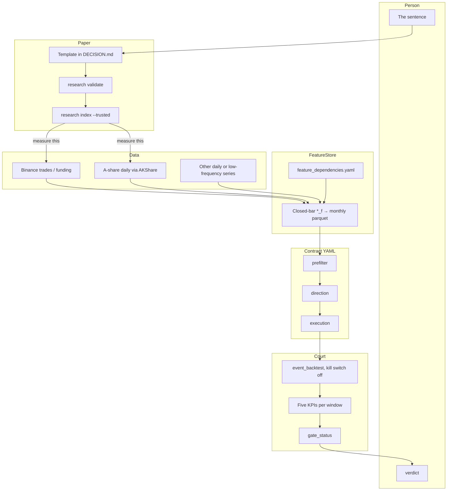
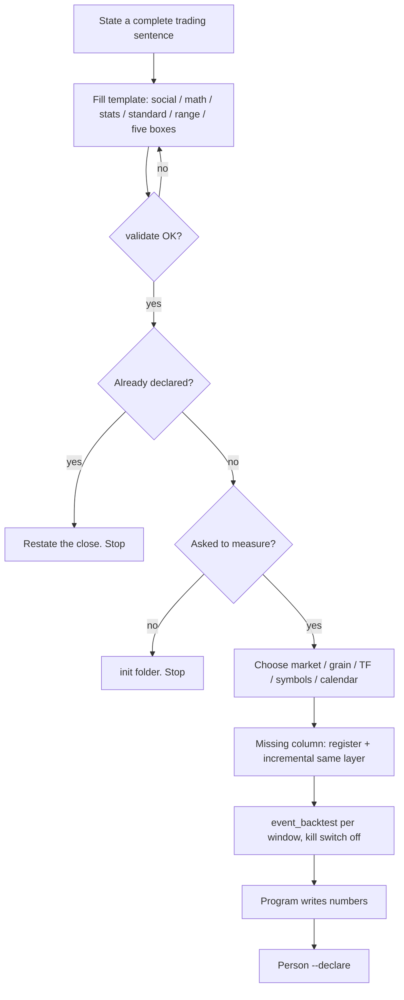

# Framework: stack, how to use, how to choose each layer

**中文:** [framework.md](framework.md)  
Landing: [README.md](../README.md) · who writes which field: [ARCHITECTURE.en.md](ARCHITECTURE.en.md)

This repo is a **hypothesis validator**. The stack keeps one sentence on one ruler, locally reviewable.  
The flow is: person talks → template must pass → then measure → person declares.  
Layer standards: timeframe, calendar, symbols, and grain **may vary**. Do not borrow another market’s ruler.

---

## 1. Technical architecture (why trust it)

A web AI uses articles and memory. Here measurement is locked to four local layers: raw data, FeatureStore, contract YAML, event backtest. Changing the model cannot change the numbers.



| Layer | Locked | Not locked |
|---|---|---|
| Data | Local files, reviewable; no hand-rolled klines | Must be Binance ticks. Daily, funding, index are fine if they match the math |
| Features | Registered columns, closed-bar, backfill first | Must use every column in a fat layer |
| Contract | Entry / side / exit in the **experiment** pack; do not edit default `ma_cross` | Must be an MA family; the public dummy is only a YAML shape |
| Court | Windows, kill switch off, five KPIs, program does not write `verdict` | Must use crypto `bear_2022`; the calendar follows the **market** |

Public harness: `event_backtest`. Clock: decide at open using only the **previous closed** row. [lessons.md](lessons.md).

---

## 2. Process architecture (how to use)

Talk. Until someone says “measure this,” the AI may only fill the template, `validate`, query lineage, and create a folder.



```bash
mlbot research validate <id>
mlbot research index --trusted --query <slug>
# after “measure this”
mlbot data download …          # or download-ashare / download-funding-rate
mlbot feature-store build …
python -m scripts.event_backtest --variant-grid config/experiments/<id>/*_grid.yaml
mlbot research close <id>      # then --declare
```

---

## 3. Layer standards (choose generally)

**Rule:** download and sample what the math names. Do not switch to unrelated data to look rigorous. A window with no listing or no files is “no sample.” Do not promote on the recent window alone.

### 3.1 Claim class

| Class | Where the money comes from | When choosing data | Do not |
|---|---|---|---|
| Alpha | Better conditional expectation | Same sign across windows; survive drop-Top-3 | Prove alpha with a bull right tail |
| Fat-tail | Few extreme paths | Cover windows that can trend; drop-Top-3 is classification only | Cut the right tail to raise win rate |
| Beta | Named-factor exposure | The factor series must align onto the traded bars | Use a short detector to “protect” long beta |
| Useless | Cross-window ≤ 0 | Write the range honestly | Keep sweeping thresholds |

See [design/alpha_vs_fattail_vs_beta_CN.md](design/alpha_vs_fattail_vs_beta_CN.md).

### 3.2 Market and grain

| The math needs | Download | Path |
|---|---|---|
| In-bar size, footprint, P99 | Ticks / aggTrades | `mlbot data download` + `convert` |
| Close relationships, calendar, daily return | Daily OHLCV | `download-ashare` or any daily adapter |
| Funding crowding | Native funding cadence (~8h) | `download-funding-rate` |
| Open interest | OI parquet | `download-open-interest` |

Grain follows the **measurand**, not “the repo default 2h.”

### 3.3 Timeframe

Ask: on which bar is the decision knowable (closed-bar)? What is one “bar” in the hold contract? Does the feature window still mean the same thing (daily EMA200 ≠ 2h EMA200)?

Public YAML tokens: `120T`, `1D`, …. Changing TF means a FeatureStore partition for that TF — do not reuse 2h columns as 1D.

### 3.4 Symbols

Name the subject of the sentence. If a window has no listing or no files, that window is no-sample — do not pad with another coin. Cross-symbol features must be FeatureStore columns on the **host** bars.

### 3.5 Calendar / splits

**Any market:** at least two trend windows plus a recent/chop window (or that market’s own bear / bull / digestion). Report five KPIs **per window**. No blended CAGR. A recent sub-window cannot close the case alone.

| Market | File | Default windows | Do not |
|---|---|---|---|
| Crypto USD-M | `config/market_segment.yaml` | `bear_2022` / `bull_2023_2024` / `recent_range_to_bear` | Close on `recent_6m_oos` alone |
| A-share | `config/market_segment_ashare.yaml` | `bear_2021` / `bull_924` / `chop_recent` | Paste crypto 2022 dates onto CSI 300 |
| New market | `market_segment_<name>.yaml` + `market_segment_path` on the grid | Cut on **that** market’s regimes | Copy another market’s start/end |

### 3.6 Features

Requested columns must be registered. Missing → register `*_f`, incremental **same `--layer`**, no `compute_*` in the backtest.

### 3.7 Contract and switches

Closed-bar entry; exits named; adds off unless that is the sentence; `kill_switch: false` when ranking edge; public court USD-M; five KPIs only.

---

## 4. Measured examples on those layers

`verdict` stays empty. This table shows **how layers were chosen**.

| Layer | Golden cross | Funding fade | Monday rebound | BTC→AI alts | P99+BB chase |
|---|---|---|---|---|---|
| Class | beta / trend | crowded fade | calendar alpha | **beta** | momentum / **fat-tail** |
| Market | crypto | crypto | **A-share** | crypto | crypto |
| Grain | trades→2h | trades + **funding** | **daily** | trades→2h (daily would suffice) | **tick** |
| TF | `120T` | `120T` (z on funding obs) | `1D` | `120T` | `120T` |
| Symbols | BTCUSDT | BTCUSDT | 000300.SH | NEAR/FET/RENDER | BTCUSDT |
| Calendar | crypto 3 | crypto 3 | **A-share 3** | crypto 3; **2022 no sample** | crypto 3 |
| Feature | `ema_50_200_cross_*` | `funding_rate_zscore_50` | `monday_down` | `btc_prior_bar_return` | P99 + `bb_position` |
| Contract | lose EMA50 | z back to 0 | hold 4 daily bars | hold 6×2h | back inside band or 12 bars |
| Local CAGR | +3.7 / +3.0 / **−3.1** | +2.7 / +3.0 / **−3.4** | +0.61 / +0.46 / +0.06 | n/a / +2.81 / **−1.52** | +0.24 / **−0.25** / +0.28 |

Golden cross, funding, P99, and the alt recent window each hit their written falsifier on at least one window. Monday stays positive but almost flat recently. 2022 alts have no sample — that is the range rule working. P99 needs ticks; Monday needs daily; funding needs funding files. Same court, different grain.

Walkthroughs: [README.md](../README.md) · [examples/](examples/).
