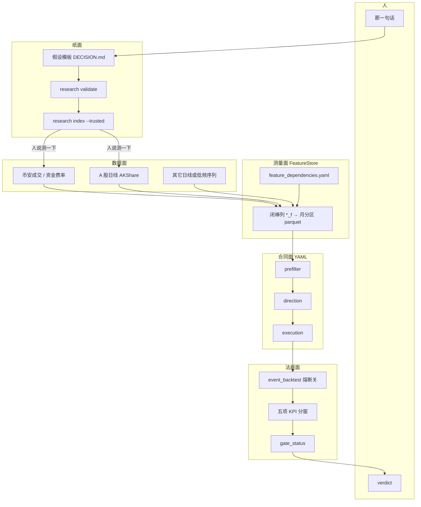
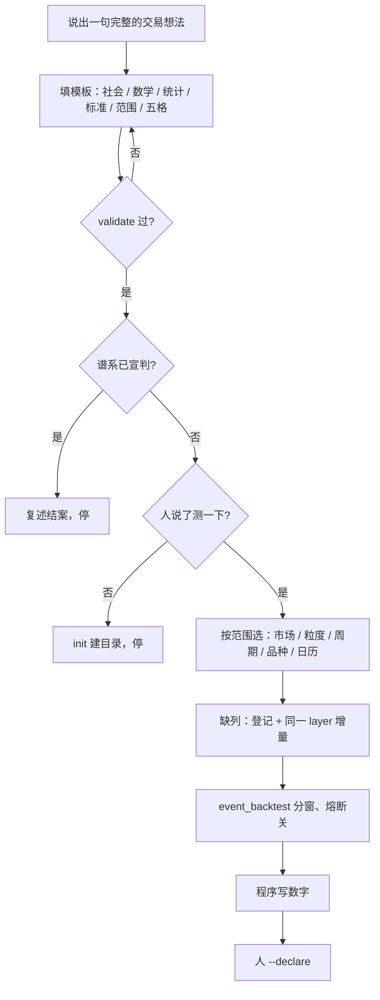

# 框架：技术栈、怎么用、各层怎么选

**English:** [framework.en.md](framework.en.md)  
主入口：[README_CN.md](../README_CN.md) · 谁写哪一格：[ARCHITECTURE.md](ARCHITECTURE.md)

本仓库是**假设验证器**。技术栈保证「同一句话、同一把尺子、本机可复查」。  
流程保证「人说话 → 模板过了才量 → 人宣判」。  
各层标准保证：周期、日历、品种、数据粒度**可以换**，但不能混用别的市场的尺子。

---

## 1. 技术架构（为什么能信）

网上的 AI 用网页和记忆。这里把测量锁在本机四层上：原始成交、特征库、合同 YAML、事件回测。换模型不能改数字。



| 层 | 锁什么 | 不锁什么 |
|---|---|---|
| 数据 | 本机文件，可复查；禁止手写 kline | 必须是币安 tick。日线、资金费率、指数都可以，**和数学对口即可** |
| 特征 | 登记过的列、闭棒、缺列先 backfill | 必须用某一层的全部 100+ 列 |
| 合同 | 进 / 向 / 出写在实验包 YAML，不改默认 `ma_cross` | 必须是均线家族；公开练习只是 YAML 形状 |
| 法庭 | 分窗、熔断关、五项 KPI、程序不写 `verdict` | 必须用币圈 `bear_2022`；日历跟市场走 |

默认那条路是一根品种、一根根进出。  
每天给全市场打分、买最热的一档，是另一句比较：[cs_panel_CN.md](cs_panel_CN.md)。一季一季点名、拿满年数，又是另一句。  
开盘做决定，只读**上一根已经收完**的数字。细则：[lessons.md](lessons.md)。

---

## 2. 流程架构（怎么用）

人平时说话。没说「测一下」，AI 只许填模板、`validate`、查谱系、建目录。



对照命令（自己敲或让 AI 编排，同一条路）：

```bash
mlbot research validate <id>
mlbot research index --trusted --query <slug>
# 人说测一下之后
mlbot data download …          # 或 download-ashare / download-funding-rate
mlbot feature-store build …    # 缺列才建；复用旧层
python -m scripts.event_backtest --variant-grid config/experiments/<id>/*_grid.yaml
mlbot research close <id>      # 人再 --declare
```

---

## 3. 各层标准（怎么选，尽量通用）

**原则：** 数学点名什么，就下什么、用什么周期。不要为了「显得科学」换一层无关的数据。缺年的段写「无样本」，不能靠近窗单独结案。

还没发生的故事（「下一家十倍股是谁」）没有闭棒列，**不能**当假设去量。只能量已经发生过的规则（例如入场日小市值、固定拿满年数）。那种句子要 **cohort 面板**，不是 `event_backtest`。已量例子：[examples/20260911_tenbagger_smallcap_CN.md](examples/20260911_tenbagger_smallcap_CN.md)。

「每天对全市场打分、买前 20%」不是一根品种进出，见 [cs_panel_CN.md](cs_panel_CN.md)。已量的两句都不成立——能这样量，不是推荐策略。

### 3.1 声称分类（先选尺子）

| 类 | 钱从哪来 | 选数据时 | 不要 |
|---|---|---|---|
| Alpha | 条件期望更好 | 跨窗同号才算；去 Top-3 仍为正才敢当独立 alpha | 用牛市右尾证明 alpha |
| 肥尾 | 少数极端路径 | 要覆盖能出大趋势的窗；去 Top-3 只作分类 | 为提高胜率砍右尾 |
| Beta | 点名因子上的暴露 | 因子品种必须能对齐到被测品种的棒上 | 用短探测器「保护」长 beta |
| 无用 | 跨窗 ≤ 0 | 写清楚范围即可 | 继续扫阈值救曲线 |

长文：[design/alpha_vs_fattail_vs_beta_CN.md](design/alpha_vs_fattail_vs_beta_CN.md)

### 3.2 市场与数据粒度

| 数学需要 | 下什么 | 命令 / 路径 |
|---|---|---|
| 根内大单、足迹、P99 | tick / aggTrades | `mlbot data download` + `convert` → `data/parquet_data` |
| 收盘关系、日历、日收益 | 日线 OHLCV | `mlbot data download-ashare` 或任意日线适配 → 如 `data/ashare/daily`。美股 ETF：`mlbot data download-us` → `data/eq/us/daily` |
| 资金费率拥挤 | 费率自己的节奏（约 8h） | `mlbot data download-funding-rate` |
| 持仓量 | OI parquet | `mlbot data download-open-interest` |

粒度跟**测量对象**走，不跟「仓库默认 2h」走。金叉可以是日线也可以是 2h，但必须在模板里写死，不能用网页日线图解释 2h 数字。

### 3.3 周期（timeframe）

| 问自己 | 选 |
|---|---|
| 决策在哪根棒上可知？ | 那根棒的周期（闭棒） |
| 持有是「四个交易日」还是「六根 2h」？ | 周期必须让「一根」等于合同里的一根 |
| 特征窗口（EMA200、P99 回望）在这个周期上有没有意义？ | 日线 EMA200 ≈ 年；2h EMA200 ≈ 两周。不要混称「200 日线」 |

公开 YAML 用 `120T` / `1D` 这类 token。换周期 = 换 FeatureStore 层名或同一层按该 timeframe 分区，不要把 2h 列拿去当 1D 用。

### 3.4 品种 / 宇宙

| 问自己 | 选 |
|---|---|
| 句子里的主体是谁？ | 指数、BTC、一组主题币……写进 `symbols` |
| 每段有没有上市 / 有没有数据？ | 没有就该段「无样本」，不要用别的币凑 |
| 跨品种特征（BTC 领涨）怎么对齐？ | 被测棒上的 FeatureStore 列，禁止非 FS 注入 |

流动性、上市日、停牌，都是范围的一部分，不是调参项。

### 3.5 日历 / 数据划分

**通用标准（任何市场）：** 至少两段趋势 + 一段近窗（或该市场自己的熊 / 牛 / 消化期）。分列五项 KPI。禁止合成一条年化。近窗子窗不能单独 promote。

| 市场 | 日历文件 | 默认三段 | 不要 |
|---|---|---|---|
| 币圈 U 本位 | `config/market_segment.yaml` | `bear_2022` / `bull_2023_2024` / `recent_range_to_bear` | 只用 `recent_6m_oos` 结案 |
| A 股 | `config/market_segment_ashare.yaml` | `bear_2021` / `bull_924` / `chop_recent` | 拿币圈 2022 熊套沪深300 |
| 美股 | `config/market_segment_us.yaml` | `us_covid_2020` / `us_bear_2022` / `us_bull_2023_2024` / `us_recent` | 拿币圈 2022 熊或 A 股 924 套 SPY |
| 新市场 | 自建 `market_segment_<name>.yaml`，网格里写 `market_segment_path` | 用该市场自己的政权事件切 | 抄别的市场的起止日 |

上市晚于某段起点 → 该段无样本，整句不能只靠后面两段过关。

### 3.6 特征

- 合同用到的列必须在 `features.yaml` 的 `requested_features` 里，并且已经在 DAG 登记。
- 缺列：登记 `*_f` → **同一 `--layer` 增量**，回测里不 `compute_*`。
- 跨品种：对齐到宿主棒的列（如 `btc_prior_bar_return`），不是另一条禁止回测兜底的脚本。

### 3.7 合同与评测开关

| 项 | 标准 |
|---|---|
| 进场 | prefilter + direction；开盘读上一根 |
| 出场 | 时间 / 结构 / 止损写死；例子尽量少叠加 |
| 加仓 | 默认关；加仓是另一句假设 |
| 熔断 | 比 edge 时 `kill_switch: false` |
| 保证金 | 公开法庭 USD-M；`coin_m` 故意拒绝 |
| KPI | 年化 / Calmar / 胜率 / MaxDD / Sharpe；不头条合计 R |

---

## 4. 用已量过的例子对照

数字来自本机法庭，`verdict` 仍由人写。这里只示范**各层怎么选**。过程全文都在 `docs/examples/`，每篇七段：设计 / 数据 / 特征 / IC / 验证 / 结论 / 报告解读。

### 4.1 一根品种、一条时间轴（`event_backtest`）

| 层 | 金叉 | 资金费率 fade | 周一反弹 | BTC→AI 山寨 | P99+布林追涨 |
|---|---|---|---|---|---|
| 分类 | beta / 趋势暴露 | 拥挤回吐 | 日历 alpha | **beta**（山寨对 BTC） | 动量 / **肥尾右尾** |
| 市场 | 币圈 | 币圈 | **A 股** | 币圈 | 币圈 |
| 粒度 | 成交→2h | 成交 + **费率序列** | **日线** | 成交→2h | **tick** |
| 周期 | `120T` | `120T`（z 在费率自己的 50 次观察上） | `1D` | `120T` | `120T` |
| 品种 | BTCUSDT | BTCUSDT | 000300.SH | NEAR/FET/RENDER | BTCUSDT |
| 日历 | 币圈三段 | 币圈三段 | **A 股三段** | 币圈三段；**2022 熊无样本** | 币圈三段 |
| 特征 | `ema_50_200_cross_*` | `funding_rate_zscore_50` | `monday_down` / `weekday` | `btc_prior_bar_return` | `bar_max_notional_ge_p99` + `bb_position` |
| IC | 无 | 无 | 无 | 无 | 无 |
| 合同 | 跌破 EMA50 走 | z 回 0 走 | 持有 4 根日线 | 持有 6 根 2h | 回到带内或 12 根 |
| 本机年化 | +3.7 / +3.0 / **−3.1** | +2.7 / +3.0 / **−3.4** | +0.61 / +0.46 / +0.06 | 无样本 / +2.81 / **−1.52** | +0.24 / **−0.25** / +0.28 |

### 4.2 换评测机的句子

| 层 | 十倍股队列 | 动量+成交额 | 热板块+10bp | SPY/QQQ 超跌 | 芯片开支 vs MA200 | 融资公告做多 BTC |
|---|---|---|---|---|---|---|
| 怎么出的表 | 一季一季点名、拿满年数 | 每天给股票排名 | 先给板块打分 | 两只 ETF 日线收盘 | 数比例 | 日线看过了；进出场还没跑 |
| 分类 | 肥尾极薄 / 小市值 beta | beta 续涨 → 反转 | 板块轮动 / beta | 股权 **beta** | 市况共存 / beta | 风险偏好外溢 / beta |
| 市场 | A 股 | A 股 | A 股 | **美股** | 币圈 Y + Epoch X | 币圈 |
| 粒度 | 日线 + 时点市值 | 日线全市场 | 日线 + 20 档行业快照 | ETF 日线 | 季频 CSV + 日线 | 锁定日历 + 日线 / 2h |
| IC | 无（问密度） | **有**：三段负号 | 未另出；个股 IC 已负 | 无 | 无（比例表） | **有**：−0.021，p=0.40 |
| 对照 | 同时点大市值 | 同宇宙等权 | 同宇宙同 10bp 等权 | 同窗买入持有 | 低强度日非牛比例 | 任意 5 日基线 |
| 本机结果 | 3 年十倍率 0.11% vs 0.11% | 相对等权三段都负 | 牛 −40pp / 震荡 −25pp | 择时年化全部更低 | 差 −37pp（反向） | 牛段跑输随便拿 BTC |
| 人写的结论 | 不成立 | 不成立 | 不成立 | 不成立 | 不成立 | **还不能下结论** |

读表的方法：

1. **金叉、费率、P99、山寨近窗** 都有「至少一段年化 < 0」或近窗更差——按各自证伪线已经被数字打中。判决仍空着，等人 `--declare`。
2. **周一** 三段年化为正，但近窗几乎走平；日历 alpha 很弱，不是「日线就能当账户」。
3. **山寨 2022 无样本** 是范围标准在工作：没有 tick / 未上市，就写无样本，不拿近窗单独 promote。若改日线、从 2023 起看，那是**另一句范围**，要改模板再量。
4. **P99 必须 tick**；**周一必须日线**；**费率必须费率文件**；**十倍股必须入场日市值**；**横截面必须对等权**。同一套仓库，粒度可以完全不同。
5. **IC 只探照灯。** 动量句 IC 为负，和书一致，但仍要等相对年化结案。融资句 IC ≈ 0，2h 书还空着，不能宣判。
6. **换对照就是换题。** 热板块对现金可以绿，对同成本等权可以死。SPY 择时对现金可以浅回撤，对同窗买入持有年化更低就是保险，不是 alpha。

过程全文：

- [README_CN.md](../README_CN.md) 金叉
- [examples/20260910_funding_fade_CN.md](examples/20260910_funding_fade_CN.md)
- [examples/20260911_ashare_monday_rebound_CN.md](examples/20260911_ashare_monday_rebound_CN.md)
- [examples/20260911_btc_lead_ai_alts_CN.md](examples/20260911_btc_lead_ai_alts_CN.md)
- [examples/20260911_p99_bb_break_chase_CN.md](examples/20260911_p99_bb_break_chase_CN.md)
- [examples/20260911_tenbagger_smallcap_CN.md](examples/20260911_tenbagger_smallcap_CN.md)
- [examples/20260911_ashare_cs_mom_amount_CN.md](examples/20260911_ashare_cs_mom_amount_CN.md)
- [examples/20260911_ashare_cs_sector_cost_CN.md](examples/20260911_ashare_cs_sector_cost_CN.md)
- [examples/20260914_eq_us_spy_qqq_beta_CN.md](examples/20260914_eq_us_spy_qqq_beta_CN.md)
- [examples/20260914_ai_chip_spend_btc_regime_CN.md](examples/20260914_ai_chip_spend_btc_regime_CN.md)
- [examples/20260914_ai_financing_btc_CN.md](examples/20260914_ai_financing_btc_CN.md)
- [cs_panel_CN.md](cs_panel_CN.md)

---

## 5. 换市场 / 换周期时抄这张清单

1. 句子落在哪一类（alpha / 肥尾 / beta）？
2. 测量对象需要 tick、日线，还是第三条序列？
3. 「一根」在合同里是多长？
4. 每个窗里品种是否已上市、是否有文件？
5. 日历是不是这个市场自己的政权，而不是抄币圈日期？
6. 列在不在 FeatureStore？缺了就登记 + 同层增量。
7. 证伪线和五项 KPI 分窗写死了吗？熔断关了吗？

都写进 `DECISION.md` 的「数据范围」和「验证标准」。过 `validate` 再让人说测一下。
