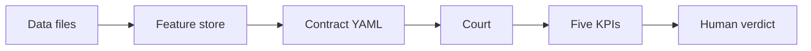

# Four local layers

**One line:** Measurement is locked on four local layers — switching AI models cannot change the numbers.

## Layers

| Layer | Locks | Does not lock |
|---|---|---|
| **Data** | Auditable local files; no hand-written klines | Must be Binance ticks — daily, funding, indexes OK if they match the math |
| **Features** | Registered closed-bar columns; backfill gaps first | Must use all 100+ columns of a layer |
| **Contract** | Entry / direction / exit in experiment YAML | Must be an MA family — public `ma_cross` is only the YAML shape |
| **Court** | Windows, kill-switch off, five KPIs; program never writes the verdict | Must use crypto `bear_2022` — calendars follow the market |

## Wrong vs right

| Wrong | Right |
|---|---|
| Treat web articles and chat memory as evidence. | Same sentence, same ruler, local files you can re-open. |

## Deeper docs

- [Framework](https://github.com/TradeEdgeX/interpretable-ml-trading/blob/main/docs/framework.en.md)
- [Architecture](https://github.com/TradeEdgeX/interpretable-ml-trading/blob/main/docs/ARCHITECTURE.en.md)
