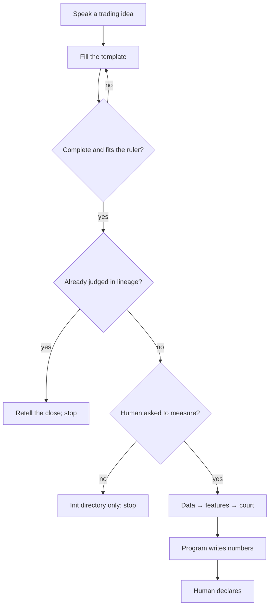

# Process

**One line:** Human writes the sentence → template must pass before measuring → human declares. No “measure this” → no download, no backtest.

## Flow

## Wrong vs right

| Wrong | Right |
|---|---|
| AI downloads, sweeps params, and says “it works” for you. | Validate the template first; don’t rescan a judged sentence; program writes numbers, human writes the verdict. |

## Deeper docs

- [Talk to the AI](../use/talk-to-the-ai.md)
- [Who writes what](../tech/who-writes-what.md)
- [Architecture](https://github.com/TradeEdgeX/interpretable-ml-trading/blob/main/docs/ARCHITECTURE.en.md)
