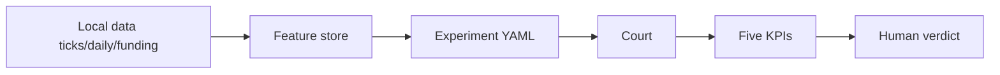

# Stack and paths

**One line:** One data path — not a pile of unrelated scripts.

## Flow

## Paths (plain)

| Path | Role |
|---|---|
| `data/` | Trades, funding, A-share daily, … |
| `feature_store/` | Monthly feature parquet |
| `config/strategies/ma_cross/` | Public practice strategy shape |
| `config/experiments/` | One hypothesis experiment pack |
| `src/features/` · `src/feature_store/` | Compute and I/O |
| `scripts/event_backtest/` | Event court |
| `src/cli/main.py` | `mlbot` entry |

This extract: **validation only** — no auto factor mining, no order routing. Execution comes later; the same validated sentence can plug in.

## Deeper docs

- [Architecture · paths](https://github.com/TradeEdgeX/interpretable-ml-trading/blob/main/docs/ARCHITECTURE.en.md)
- [Usage](https://github.com/TradeEdgeX/interpretable-ml-trading/blob/main/docs/usage.en.md)
