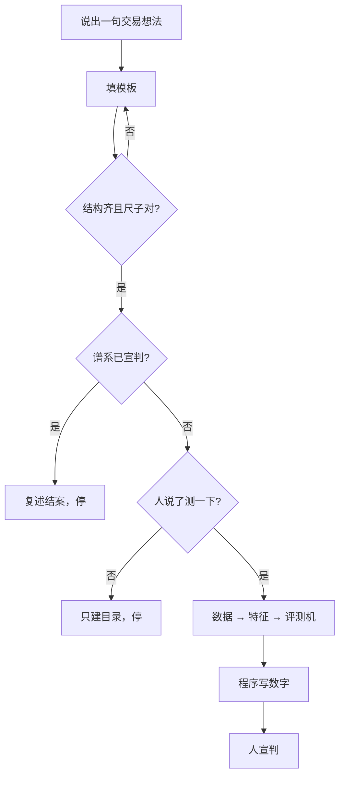

# 验证流程

**一句话：** 人出句 → 模板过了才量 → 人宣判。没说「测一下」就不下载、不回测。

## 流程

## 错 vs 对

| 错 | 对 |
|---|---|
| AI 听完就拉数据、扫参数、代你说「成立」。 | 先验模板；已宣判的同一句不要再扫；数字由程序写，判决由人写。 |

## 还想看细则

- [跟 AI 说话](../use/talk-to-the-ai.md)
- [谁写哪一格](../tech/who-writes-what.md)
- [架构](https://github.com/TradeEdgeX/interpretable-ml-trading/blob/main/docs/ARCHITECTURE.md)
